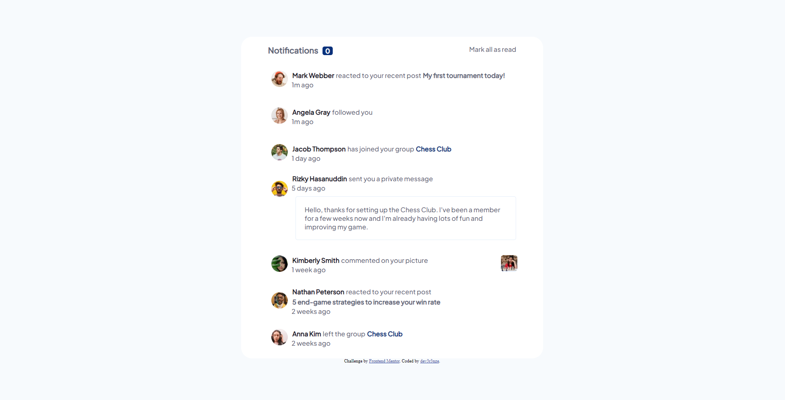

# Frontend Mentor - Notifications page solution

This is a solution to the [Notifications page challenge on Frontend Mentor](https://www.frontendmentor.io/challenges/notifications-page-DqK5QAmKbC). Frontend Mentor challenges help you improve your coding skills by building realistic projects. 

## Table of contents

- [Overview](#overview)
  - [The challenge](#the-challenge)
  - [Screenshot](#screenshot)
  - [Links](#links)
- [My process](#my-process)
  - [Built with](#built-with)
  - [What I learned](#what-i-learned)
- [Author](#author)

**Note: Delete this note and update the table of contents based on what sections you keep.**

## Overview

### The challenge

Users should be able to:

- Distinguish between "unread" and "read" notifications
- Select "Mark all as read" to toggle the visual state of the unread notifications and set the number of unread messages to zero
- View the optimal layout for the interface depending on their device's screen size
- See hover and focus states for all interactive elements on the page

### Screenshot

### Links

- Solution URL: [Github](https://github.com/Dev3r3nze/FrontendMentor)

## My process

### Built with

- Semantic HTML5 markup
- CSS custom properties
- Flexbox

### What I learned

Aprendí a usar e implementar formas con svg, aprendí como cabiar la clase de un div desde js y  tambíen refocé mis conocmientos sobre la propiedad flex.

### Continued development

No llegé a hacer el responsive para movil ni le dediqué mucho tiempo a el responsive en general, para próximos proyectos debería tenerlo más en cuenta.

## Author

- Frontend Mentor - [@dev3r3nze](https://www.frontendmentor.io/profile/yourusername)
- Twitter - [@dev3r3nze](https://www.twitter.com/dev3r3nze)
